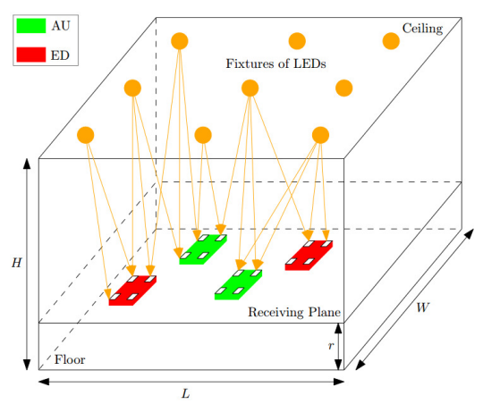

# Zero-Forcing Beamforming for Visible Light Communication Systems

Project developed for the course INF567: Wireless Networks at Ecole polytechnique. The goal of this project is to explore the **zero-forcing beamforming** technique proposed in [[2]](#2) for Physical Layer Security(PLS) to prevent both active and passive eavesdropping on VLC systems and attempt to replicate their results.

**Table of contents**
- [Introduction](#introduction)
- [Modelisation: door VLC wiretap system](#modelisation-indoor-vlc-wiretap-system)
- [Beamforming](#beamforming)
- [References](#references)

## Introduction

The literature review performed on [[1]](#1) was the basis for the bibliography study performed on this project. It is important to highlight that VLC systems are not intended to replace RF technologies. VLC systems are more efficient in indoor environments and are complementary to RF technologies.

We consider an IM/DD MIMO VLC system with multiple *Access Points(APs)*, a single *Authorized Users(AUs)* and multiple *Eavesdropping devices(active AEDs or passive PEDs)*.

- **IM** (intensity modulation) refers to the method of encoding information by varying the intensity of the light source, which is then detected by a receiver.

- **DD** (direct detection) refers to the detection of the transmitted signal by directly measuring the intensity of the received light, typically using a photodiode, without needing to decode phase or frequency information.

## Modelisation: Indoor VLC Wiretap System

As in [[1]](#1), we consider a room os size $L \times W \times H$. The room is equipped with $N$ APs that are located at its ceiling. The APs act as single transmitters, sending simultaneously the confidential message signal $s(t)$ to the AU in the presence of $P$ known AEDs $\{ AE_1, AE_2, ..., AE_P \}$ and $Q$ unknown randomly distributed PEDs $\{ PE_1, PE_2, ..., PE_Q \}$. We use the index $k \in \{AU, AE_p, PE_q\}$ to refer to a generic device.

## Beamforming

Our goal is to determine the beamforming vector $w = [w_1,w_2,...,w_N]^T \in \mathbb{R}^N$ where $w_i$ is a weight for the signal from the $i$-th transmitter.

The traditional zero-forcing beamformer for a single AED $AE_1$, where the PEDs are ignored, can be obtained by projecting the AU's channel onto the null space of the AED (making the SNR at the AED equal to zero).

## References

<a id="1">[1]</a> Mohamed Amine Arfaoui, Mohammad Dehghani Soltani, Iman Tavakkolnia, Ali Ghrayeb, Majid Safari, Chadi M. Assi, Harald Haas (2020).
**Physical Layer Security for Visible Light
Communication Systems: A Survey** IEEE Communications Surveys and Tutorials.

<a id="2">[2]</a>
Sunghwan Cho, Gaojie Chen, Justin P. Coon (2021).
**Zero-Forcing Beamforming for Active and Passive Eavesdropper Mitigation in Visible Light Communication Systems** IEEE Transactions on Wireless Communications.
